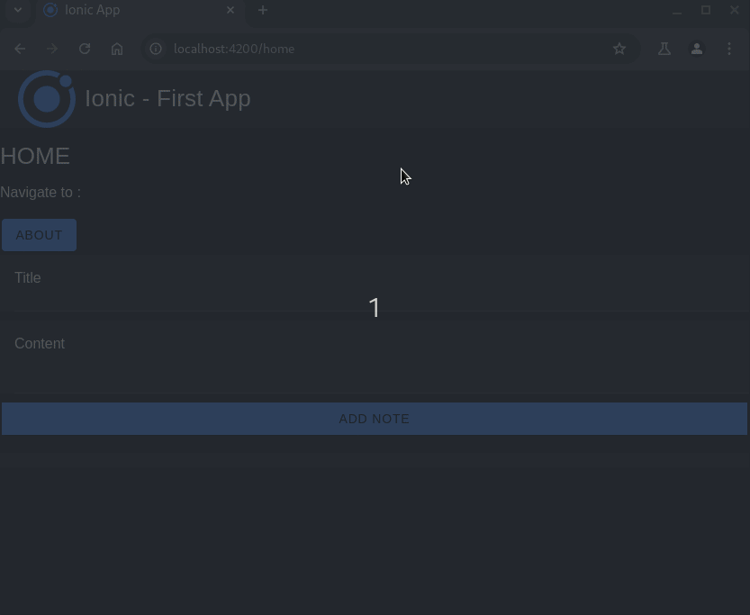

# Ionic Angular App Example

Este es un ejemplo de una aplicación creada con Ionic y Angular.

## Instalación

Para instalar las dependencias del proyecto, ejecuta:

```bash
npm install
```

## Ejecución

Para ejecutar la aplicación en modo de desarrollo, usa:

```bash
ionic serve
```

## Construcción

Para construir la aplicación para producción, ejecuta:

```bash
ionic build
```

## Capturas de Pantalla

Aquí puedes ver algunas capturas de pantalla de la aplicación:




## Licencia

Este proyecto está bajo la Licencia MIT. Consulta el archivo [LICENSE](LICENSE) para más detalles.
